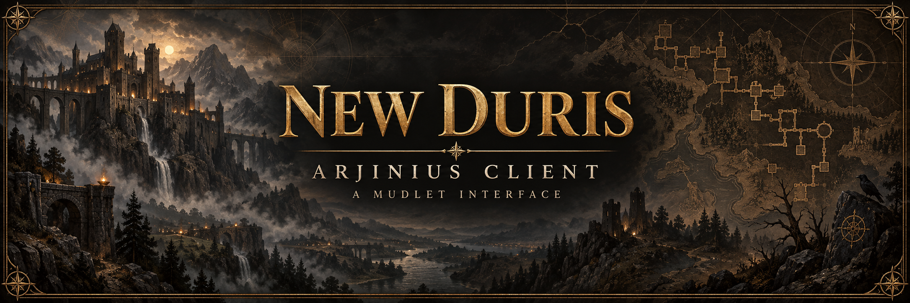
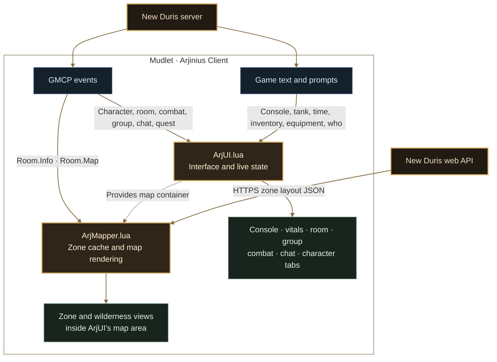

<p align="center">
  
</p>

<p align="center">
  <a href="https://github.com/Community-Duris/duris-client/releases/latest"></a>
  <a href="https://www.mudlet.org/download/"></a>
  <a href="src/scripts/"></a>
  <a href="src/scripts/ArjUI.lua"></a>
</p>
<p align="center">
  <a href="#new-duris--arjinius-client"></a>
  <a href="#install"></a>
  <a href="#build-and-contribute"></a>
  <a href="https://github.com/Community-Duris/duris-client/releases/latest/download/duris-client.mpackage"></a>
</p>

# New Duris · Arjinius Client

**The world in view. Your adventure at the center.**

A custom [Mudlet](https://www.mudlet.org/) interface for [New Duris](https://www.newduris.com/), with a bronze-and-charcoal frame, live character information, integrated maps, and organized chat. Its three-column layout keeps the game console central while room, group, and combat details stay within reach.

This is a **client-side UI package**. Clickable controls send game commands you choose; the package does not automate playing your character or change the game's mechanics.

**[Install](#install)** · **[Features](#features)** · **[Commands](#commands)** · **[How it works](#how-it-works)** · **[Build and contribute](#build-and-contribute)**

## Install

You need **Mudlet 4.19.1 or newer**, a New Duris profile, and **GMCP enabled** in both the Mudlet profile and the game. Zone maps also need access to `www.newduris.com` over HTTPS.

1. **[Download duris-client.mpackage](https://github.com/Community-Duris/duris-client/releases/latest/download/duris-client.mpackage)** from the [latest release](https://github.com/Community-Duris/duris-client/releases/latest). Each release lists its changes and a SHA-256 checksum; you do not need to build it yourself.
2. Open your New Duris profile in Mudlet.
3. Open **Package Manager** (`Alt+O`), choose **Install New Package**, and select the downloaded `.mpackage`. See the [Mudlet Package Manager guide](https://wiki.mudlet.org/w/Manual:Package_Manager) for details.
4. Reconnect and enter the game so fresh character and room data can populate the interface.

The package is named **Arjinius Client** inside Mudlet. For updates, download the `.mpackage` from the [latest release](https://github.com/Community-Duris/duris-client/releases/latest), replace your installed copy through Package Manager, and reconnect. See [`CHANGELOG.md`](CHANGELOG.md) for what changed.

## Features

| At a glance | What the client provides |
| --- | --- |
| **A cohesive interface** | A dark fantasy frame, percentage-based layout, central game console, and dedicated command input. |
| **Character and quests** | HP, mana, movement, progress toward the next level, position, character identity, coins, and active bartender quest details. Non-mana classes show **MP n/a**. |
| **Zone and wilderness maps** | Zone layouts from the New Duris map API and wilderness maps from GMCP, with zoom controls, room tooltips, and a current-position marker. |
| **Room awareness** | Clickable exits, distinct closed/locked exit styles, lists of mobs, items, and players, plus NPC annotations showing whom they are fighting. |
| **Combat and groups** | Target health and position, a prompt-derived tank display, affects, group size/capacity, and dimmed **AWAY** markers for members outside your room. |
| **Chat that stays organized** | **ALL / TELLS / NCHAT / ROOM / GUILD / GROUP**, with individual tell windows, contact history for the current session, and alignment-colored nchat/jchat senders. |
| **Useful details nearby** | Inventory, equipment, and who-list panels; context menus for common actions; in-game time; links to the world map and current zone's wiki page. |

Guild `gcc` messages route to **GUILD**, group `gsay` to **GROUP**, and `jchat` to **NCHAT**. `petition` and `wizmsg` appear in **ALL** with distinct colors. Tell windows and their history are session-only.

## Commands

Type these into the Mudlet command input:

| Command | Purpose |
| --- | --- |
| `ui on` | Initialize or rebuild the interface. |
| `ui off` | Hide the interface and restore Mudlet's main console and command line. |
| `ui debug` | Show which core GMCP data tables have arrived. |
| `mapper` | Show mapper help. |
| `mapper on` / `mapper off` | Enable or pause mapper updates. |
| `mapper status` | Show the current map mode, room, zone, and cache statistics. |
| `mapper debug` | Inspect current room, exit, and cached zone data. |
| `mapper reload` | Clear cached zone layouts; move or use `look` to request fresh room data and reload the map. |
| `mapper size 14` | Set zone room size; accepts integers from **8–20**. |
| `/mapreload` | An additional shortcut to clear the map cache. |

Use the map's **+ / −** controls to zoom. Click the active **STATS**, **INV**, **EQ**, or **WHO** tab to send `stat`, `inv`, `eq`, or `who` and refresh the corresponding information.

## How it works

Two Lua scripts run inside Mudlet. **ArjUI** builds the Geyser interface and processes live game information. **ArjMapper** uses the map area provided by ArjUI, combining room data with downloaded zone layouts or the server's wilderness map.



Most live panels use GMCP. Inventory, equipment, and who lists capture game text; tank and time displays also depend on text triggers. Zone layouts come from `https://www.newduris.com/api/wiki/zones/{zoneId}/map-data` and are cached in memory. The mapper listens to `Room.Info` and `Room.Map` directly.

## Troubleshooting and current limits

- **Empty vitals or room panels:** run `ui debug`, check that GMCP is enabled, then reconnect and enter the game. Initial character setup uses `Char.Status` on login.
- **Blank or stale zone map:** run `mapper status` and `mapper debug`, check access to the New Duris website, then try `mapper reload` followed by `look`.
- **Missing tank, inventory, equipment, who, or time information:** these displays depend on recognized text and prompt formats. Custom prompts or changed server output can affect capture even when GMCP panels work.
- **Need to restore the main console:** use `ui off`; `ui on` builds the interface again.

Ship radar, quest-map rendering, and the server's structured chat color runs are not implemented. Alignment coloring for other players in the room is limited by the fields the server supplies. The [server study and implementation log](docs/ongoing-projects/updates-upgrades.md) records the protocol details, completed work, and remaining candidates.

## Build and contribute

**Edit `src/`; build the package from those sources.** The build uses Python 3's standard library. It also runs a Lua syntax check when a supported `luac` executable is on your `PATH`.

```bash
# Assemble the installable package at the repository root
python3 build.py

# Syntax-check the Lua scripts only (install luac to make this check effective)
python3 build.py --check

# Write the package to another location
python3 build.py -o /tmp/duris-client.mpackage
```

| Path | Role |
| --- | --- |
| [`src/scripts/ArjUI.lua`](src/scripts/ArjUI.lua) | UI construction, GMCP handlers, text capture, chat, and commands. |
| [`src/scripts/ArjMapper.lua`](src/scripts/ArjMapper.lua) | Zone layout downloads, caching, wilderness rendering, and map controls. |
| [`src/package.xml`](src/package.xml) | Mudlet XML skeleton with `@@SCRIPT:Name@@` placeholders. |
| [`src/config.lua`](src/config.lua) | Package metadata. The build injects its version. |
| [`src/assets/`](src/assets/) | Images copied into the package unchanged. |
| [`VERSION`](VERSION) | Version source for packaged metadata and `ArjUI.VERSION`. |
| [`build.py`](build.py) | Injects Lua and version values, escapes script text, validates XML, and writes the package archive. |
| [`duris-client.mpackage`](duris-client.mpackage) | Committed build output; releases attach a copy built from the tag. |
| [`CHANGELOG.md`](CHANGELOG.md) | Release notes per version; the release workflow reads it. |
| [`.github/workflows/`](.github/workflows/) | CI build on every push; tag `v*` publishes a GitHub Release. See [`docs/RELEASING.md`](docs/RELEASING.md). |

When changing the package, bump `VERSION`, rebuild, and include the generated `.mpackage` with the source change. Let the build insert version strings; do not hand-edit the archive. Keep contributions within the client UI scope, use Mudlet/Geyser APIs without external Lua dependencies, and preserve the dark fantasy style and percentage-based layout.

**Validation is limited:** `--check` checks Lua syntax only and skips that check with a warning if `luac` is absent. A full build also validates the assembled XML. Neither verifies runtime behavior; import the package into Mudlet to check layout, GMCP updates, chat, maps, controls, and reconnect behavior. No automated runtime test suite exists in this repository.

Read [`AGENTS.md`](AGENTS.md) for repository guidance and the [Duris implementation log](docs/ongoing-projects/updates-upgrades.md) for server field names. The [Mudlet reference documents](docs/README.md) were copied from LuminariGUI and are background references; their project-specific architecture and MSDP instructions do not describe this package.

## Credits and links

Originally created by **[Arjinius / Arjin](https://github.com/Arjinius)**. Maintained here in **[Community-Duris/duris-client](https://github.com/Community-Duris/duris-client)**.

[New Duris](https://www.newduris.com/) · [World map](https://www.newduris.com/wiki/map) · [Mudlet](https://www.mudlet.org/)
